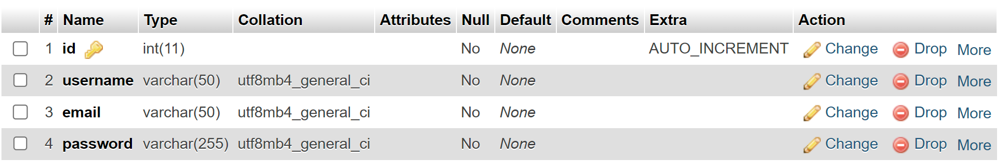
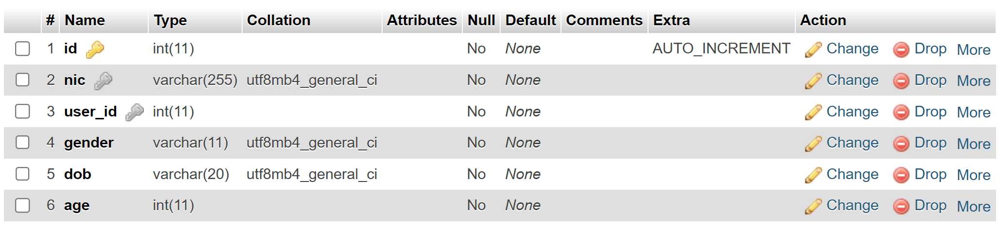

# NIC Validation Web App

## Installation

1. **Clone the repository and open the project's auth_service and user_service locations in different windows of your code editor.**  
   If you need to change the ports these two services should run on, just change the following line in both services to your preferred, but different, ports:  
   `app.run(debug=True, port=5000)`

2. **Create Python virtual environments for both services and activate them (You should have Python installed).**  
   **Windows:**  
   `python -m venv .venv`  
   `.\.venv\Scripts\Activate`  
   **Mac:**  
   `python3 -m venv .venv`  
   `source .venv/bin/activate`

3. **Install dependencies from requirements.txt for both services.**  
   **Windows:**  
   `pip install -r requirements.txt`  
   **Mac:**  
   `pip3 install -r requirements.txt`

4. **Set up environment variables with 2 .env files.**  
   In the `auth_service` directory's `.env` file, you should add the following:
   - `SECRET_KEY` (add a strong key)
   - `MYSQL_USER`
   - `MYSQL_PASSWORD`
   - `MAIL_PASSWORD`
   - `MAIL_USERNAME` (create an SMTP mail password for a Gmail account, or use your preferred mail configurations)

   In the `user_service` directory's `.env` file, you should add:
   - `SECRET_KEY`
   - `MYSQL_USER`
   - `MYSQL_PASSWORD`

   **If your MySQL server uses a port other than the default (3306), add the following line to your configuration in both service's `app.py`:**  
   `app.config['MYSQL_PORT'] = 'Your_Port'`  
   Example: `app.config['MYSQL_PORT'] = 3306`

5. **Set up the MySQL databases.**  
   Create two MySQL databases named `nic_auth_service` with a `users` table and `nic_user_service` with a `nics` table. Below are the `.sql` files for the database schemas extracted from phpMyAdmin in XAMPP. If importing the `.sql` files doesn't work, manually create the `users` and `nics` tables in the databases.  
   [Database Schema Files](https://drive.google.com/drive/folders/1KubU3mMQvj8Eg8fVzLomwVBi4ojnpNob?usp=drive_link)

   `users`  
     
   `nics`  
   

6. **Run the application locally by starting both services in separate code editor windows.**  
